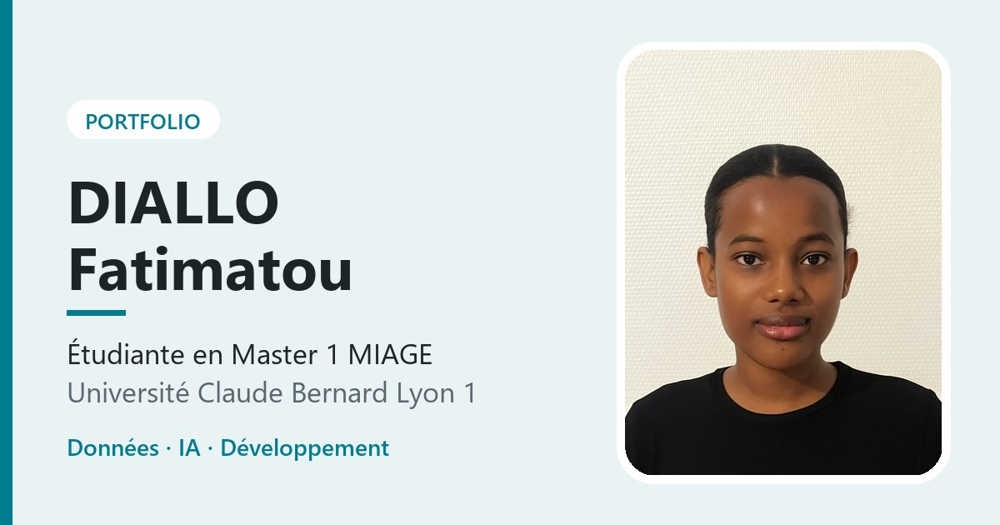

# Portfolio – Diallo Fatimatou

Portfolio personnel d’une étudiante en **Master 1 MIAGE** à l’École Polytechnique de l’Université Claude Bernard Lyon 1 : formation, expériences, projets et compétences.

🔗 **Site en ligne : https://fatima-d-hub.github.io/portfolio/**
🇬🇧 English version: https://fatima-d-hub.github.io/portfolio/?lang=en



## Fonctionnalités

- Site statique hébergé sur **GitHub Pages**
- **Bilingue français / anglais**, avec un sélecteur dans la barre de navigation
- **Mode clair / sombre** (suit le réglage du système, puis mémorise le choix)
- Responsive (ordinateur, tablette, mobile)
- Formulaire de contact via [FormSubmit](https://formsubmit.co), sans serveur

## Technologies

HTML · CSS · JavaScript · Bootstrap 5 · Font Awesome · Google Fonts (Inter, Poppins)

## Structure

```
index.html          Page unique (textes français)
css/style.css       Styles, couleurs des modes clair et sombre
js/i18n.js          Traductions anglaises et changement de langue
js/script.js        Formulaire, bouton « Voir plus », mode sombre
ressources/         CV, photos, favicon, image d’aperçu
```

## Modifier un texte

Chaque texte traduit porte un attribut `data-i18n="cle"` :

- **français** : directement dans `index.html`
- **anglais** : la même clé dans `js/i18n.js`

## Lancer en local

Ouvrir `index.html` dans un navigateur, ou passer par un serveur local (WAMP, `python -m http.server`…). Le formulaire de contact ne fonctionne qu’à travers un serveur web.

## Contact

- LinkedIn : [linkedin.com/in/fatimatou-diallo](https://www.linkedin.com/in/fatimatou-diallo-869974324)
- GitHub : [github.com/fatima-d-hub](https://github.com/fatima-d-hub)
